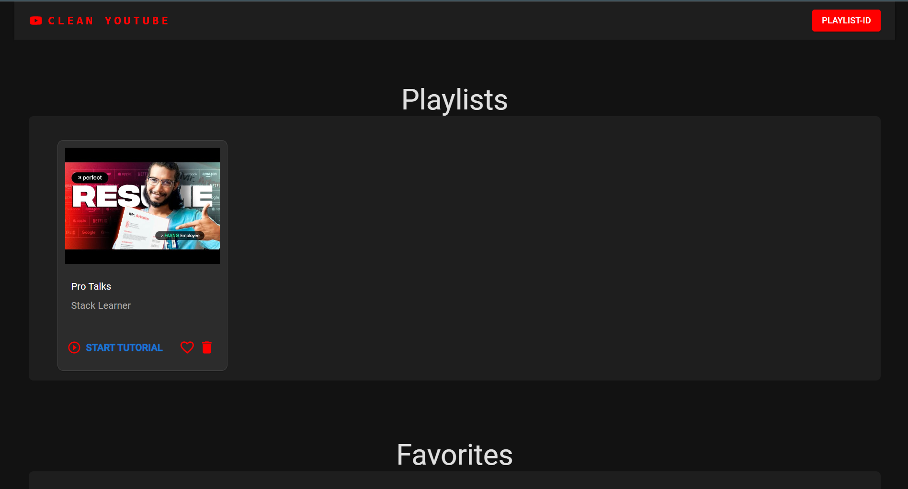
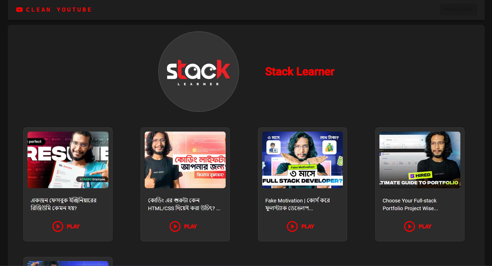
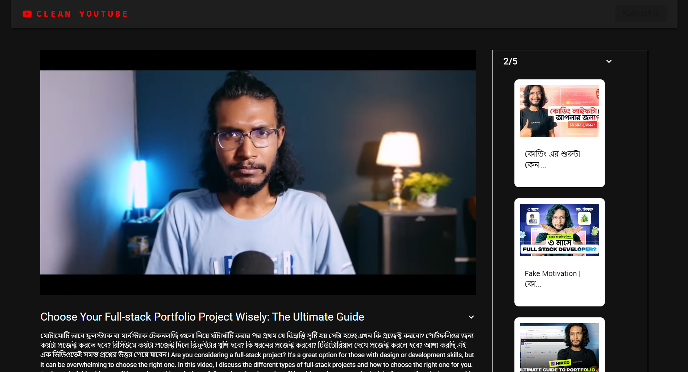

# Clean YouTube 🎥✨

**Clean YouTube** is a web application designed to provide a distraction-free YouTube experience by allowing users to paste YouTube playlist URLs or IDs and watch videos in a cleaner interface. Whether you're learning, focusing on tutorials, or just want a simpler viewing environment, Clean YouTube keeps you focused.

## Features 🚀

- **Distraction-Free Interface**: Watch YouTube videos without unnecessary elements, focusing on what matters.
- **Playlist Management**: Add and organize your playlists. Save your favorite playlists and track recently watched ones.
- **Dark Mode**: A sleek dark theme for an enjoyable viewing experience, especially at night.
- **Fully Responsive**: Optimized for all screen sizes, from desktop to mobile.
- **Easy Navigation**: Search and browse through playlists with a simple and intuitive UI.

## Tech Stack 🛠️

- **Frontend**: React, React Router, Material UI (MUI)
- **State Management**: Easy Peasy (based on Redux)
- **Video Player**: React Player
- **API**: YouTube Data API

## Installation

1. **Clone the repository:**

   ```bash
   git clone https://github.com/yourusername/world-clock-app.git
   cd Track_Zone
   yarn or npm install
   yarn dev or npm run dev
   ```

2. **Visual looks:**

   
   
   
